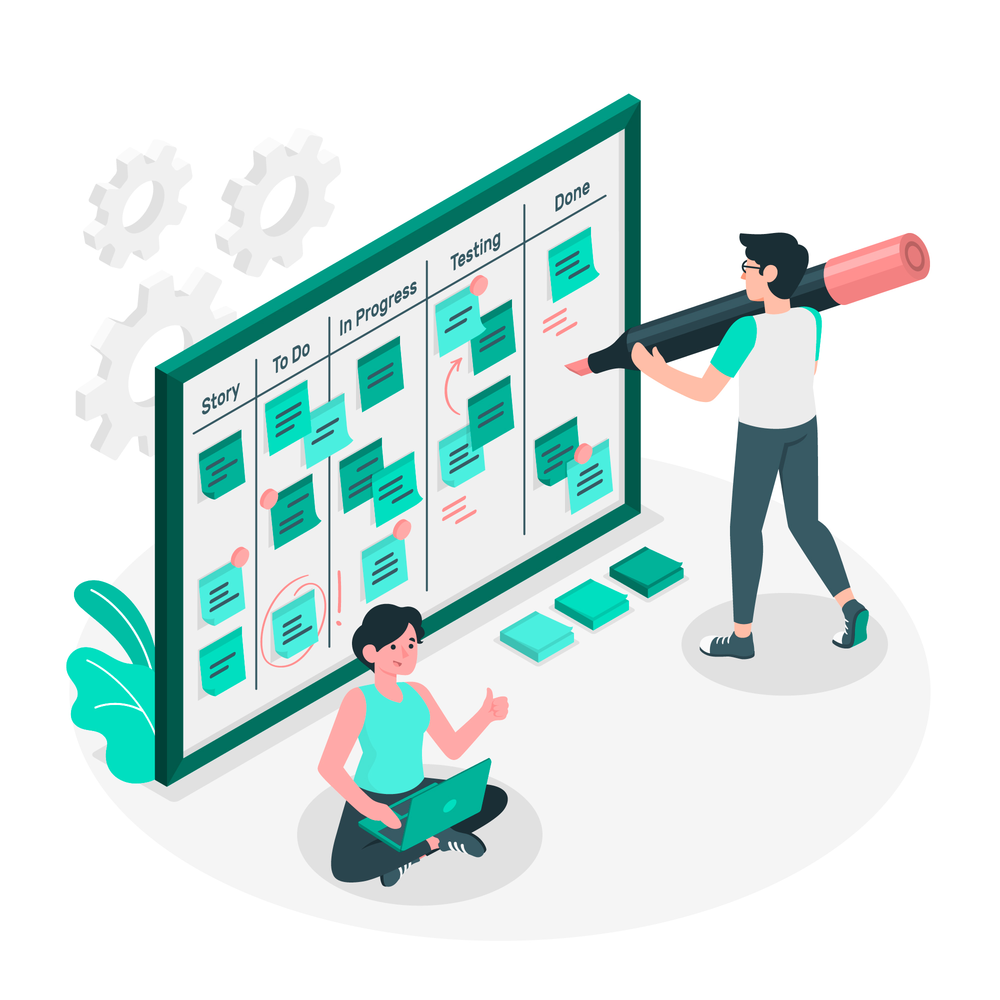
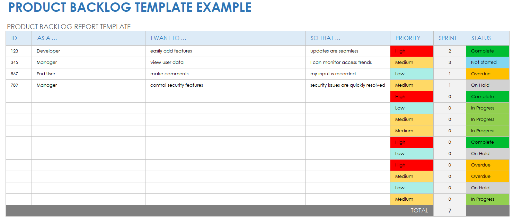
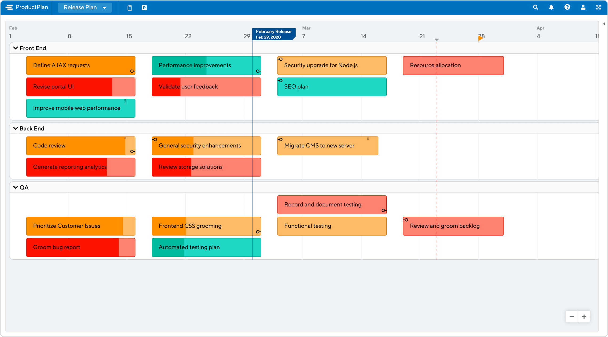
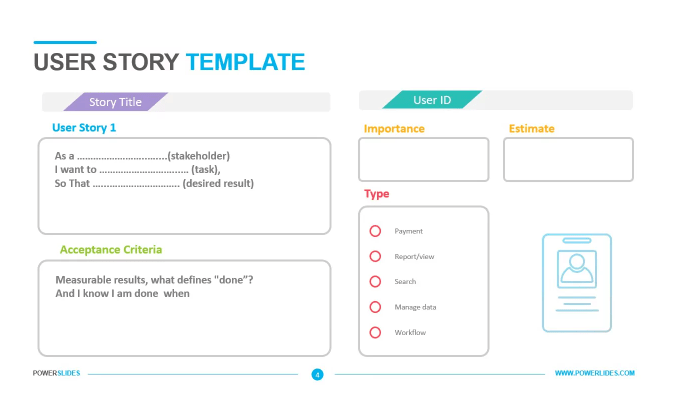
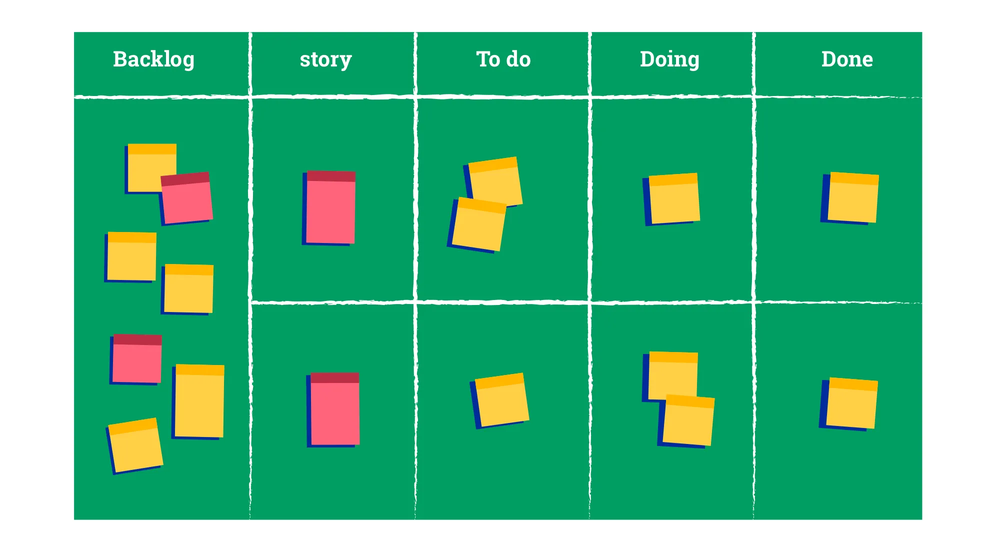

# Introduction aux méthodes Agile

# Introduction aux Méthodes Agiles

L'introduction aux méthodes agiles est conçue pour fournir une compréhension fondamentale de cette approche de gestion de projet, qui se distingue par sa flexibilité, son adaptabilité et son orientation vers la satisfaction du client. Cette section mettra en lumière les définitions, les principes clés, ainsi que les avantages et les défis associés à l'implémentation de pratiques agiles.

## 🔑 Définition et Principes des Méthodes Agiles

### 🔍 Qu'est-ce que les Méthodes Agiles ?

Les méthodes agiles regroupent diverses pratiques de gestion de projet axées sur la livraison itérative de produits, en mettant l'accent sur la collaboration, la flexibilité, la qualité du produit, et la réactivité aux changements. Originellement développées pour le secteur du logiciel, ces méthodes sont maintenant appliquées dans divers autres domaines.

### 🔑 Principes Clés des Méthodes Agiles

Le Manifeste Agile, publié en 2001, établit les valeurs et principes fondamentaux qui guident les méthodes agiles. Ces principes encouragent les équipes à valoriser :

- **Les individus et leurs interactions** plus que les processus et les outils
- **Un logiciel fonctionnel** plus que la documentation exhaustive
- **La collaboration avec le client** plus que la négociation contractuelle
- **L'adaptation au changement** plus que le suivi d'un plan

### 📊 Tableau de Synthèse des Principes Agiles

| Valeur Agile | Explication |
| --- | --- |
| Individus et interactions | Priorisation de la communication et la collaboration pour optimiser les résultats. |
| Logiciel opérationnel | Focus sur la livraison fréquente de fonctionnalités utiles pour obtenir un feedback rapide. |
| Collaboration avec les clients | Engagement continu du client tout au long du projet pour garantir que le produit répond à ses besoins. |
| Adaptation au changement | Flexibilité pour répondre aux changements, même tard dans le cycle de développement. |

## 🔍 Enjeux et Applications des Méthodes Agiles

### ⏱️ Time-to-Market

Réduire le temps de mise sur le marché est crucial dans un environnement compétitif. Les méthodes agiles, par leur nature itérative, permettent de lancer des produits plus rapidement et d'ajuster en continu en fonction des retours du marché.

### 20/80 Principe de Pareto

Appliquer le principe de Pareto signifie se concentrer sur les 20% d'efforts qui génèrent 80% des résultats. En agilité, cela se traduit par la priorisation des fonctionnalités qui apportent le plus de valeur aux utilisateurs.

### 🏆 Concurrence

La capacité d'adaptation rapide offerte par les méthodes agiles permet aux entreprises de rester compétitives, en ajustant leurs produits et services pour mieux répondre aux exigences changeantes des consommateurs et aux dynamiques du marché.

### 🔄 Comparaison entre les Méthodes Agiles et le Cycle en V

| Critère | Méthodes Agiles | Cycle en V |
| --- | --- | --- |
| Approche | Itérative et incrémentale | Séquentielle et basée sur des phases claires |
| Flexibilité | Haute, avec des adaptations constantes au feedback | Faible, modifications difficiles après démarrage |
| Livraison | Continuelle, en petites fonctionnalités fonctionnelles | Unique, en fin de cycle |
| Feedback | Constant, à chaque itération | En fin de processus, lors des tests |
| Gestion des risques | Continue et intégrée | Principalement en début de projet |
| Implication du client | Très élevée tout au long du projet | Moins fréquente, souvent limitée aux phases clés |
| Documentation | Juste suffisante pour le développement | Très détaillée et formelle |
| Convient pour | Projets flexibles avec des exigences changeantes | Projets avec des exigences claires et stables |

Cette introduction vise à équiper les participants avec les connaissances de base nécessaires pour comprendre et appliquer les méthodes agiles dans leurs propres projets, tout en soulignant leur pertinence et efficacité dans le contexte actuel de développement rapide et adaptatif.

## 🔑 2. Étude et Conception

Cette section détaille les différentes étapes de l'étude et de la conception dans un projet, en mettant l'accent sur l'importance de chaque phase pour assurer le succès et la viabilité du produit final.

### 🎨 Expression de besoins/Design Thinking

- **Objectif** : Utiliser le Design Thinking pour comprendre et définir les besoins des utilisateurs de manière créative et centrée sur l'humain.
- **Discussion** : Comment cette approche favorise l'innovation et l'alignement des solutions avec les vraies attentes des utilisateurs.

| Aspect | Détails |
| --- | --- |
| Approche | Empathie, définition, idéation, prototypage, test |
| Bénéfices | Meilleure compréhension des besoins utilisateurs, solutions innovantes |

### 📜 Note de cadrage

- **Définition** : Document définissant les contours du projet, les objectifs, et les attentes des différentes parties prenantes.
- **Importance** : Sert de référence tout au long du projet pour maintenir l'alignement entre les parties prenantes.

| Element | Description |
| --- | --- |
| Objectifs | Clarifier la vision du projet |
| Portée | Délimiter les limites du projet |

### 📝 Cahier des charges

- **Explication** : Description détaillée des exigences techniques, fonctionnelles et opérationnelles du projet.
- **Rôle** : Sert de base pour le développement et assure que toutes les parties prenantes ont une compréhension claire des attentes.

| Exigences | Types |
| --- | --- |
| Techniques | Infrastructure, logiciels, matériels |
| Fonctionnelles | Fonctions du système, intégrations |

### 🛡️ Gestion des risques et anticipations

- **Approche** : Identification, analyse et réponse aux risques potentiels dès le début du projet.
- **Stratégies** : Intégration des mesures de mitigation dans la planification pour prévenir ou minimiser les impacts négatifs.

| Risque | Mitigation |
| --- | --- |
| Technologique | Prototypes, tests |
| Projet | Revues régulières, gestion agile |

### 📊 Macroplanning et Budget / proposition financière

- **Présentation** : Établissement des grandes lignes du projet, incluant les étapes clés et les prévisions budgétaires.
- **Alignement** : Assure que les ressources financières sont en adéquation avec les phases du projet et les résultats attendus.

| Phase | Budget prévu |
| --- | --- |
| Conception | X euros |
| Développement | Y euros |

### 📋 Backlogs

- **Introduction** : Présentation du concept de backlog dans une approche agile.
- **Importance** : Central pour la planification continue et l'adaptation aux changements tout au long du projet.

| Type | Description |
| --- | --- |
| 📦 Produit | Liste de toutes les fonctionnalités souhaitées |
| 🏃‍♂️ Sprint | Fonctionnalités sélectionnées pour le prochain sprint |

### 📝 Cahier de recette

- **Définition** : Document qui spécifie les critères d'acceptation des livrables du projet.
- **Rôle** : Essentiel pour garantir que les livrables correspondent aux exigences définies dans le cahier des charges.

| Critère | Importance |
| --- | --- |
| ✅ Conformité | Assure l'adéquation avec les exigences |

### 🎨 Maquette UI/UX

- **Discussion** : Importance de la conception des interfaces utilisateur et de l'expérience utilisateur pour l'ergonomie et la satisfaction des utilisateurs finaux.
- **Processus** : Étapes de création des maquettes et de tests utilisateurs pour valider l'approche.

| Étape | Activité |
| --- | --- |
| 🖌️ Design | Wireframes, prototypes interactifs |

### 🏗️ Proposition d'architecture

- **Aperçu** : Formulation et validation de l'architecture système proposée pour le projet.
- **Importance** : Fondamentale pour assurer la scalabilité, la performance, et la sécurité du système.

| Composant | Description |
| --- | --- |
| 🖥️ Serveurs | Spécifications techniques |
| 💻 Logiciel | Choix des technologies |

### 🛠️ POC/Prototype - Développement pour valider l'architecture

- **Description** : Création de prototypes ou de POCs pour tester les aspects techniques et fonctionnels avant le développement à grande échelle.
- **Objectif** : Validation précoce pour éviter des erreurs coûteuses en phase de développement.

| POC | Objectif |
| --- | --- |
| 🧪 Prototype | Test d'intégration, fonctionnalité |

### 📅 Planification, Release Planning/Sprint Planning

- **Introduction** : Méthodologie pour la gestion du temps et des ressources à travers le Release Planning et le Sprint Planning.
- **Discussion** : Importance de ces activités pour aligner les capacités de l'équipe avec les objectifs à long et à court terme.

| Planification | Focus |
| --- | --- |
| 🚀 Release | Objectifs à long terme |
| 🏃‍♂️ Sprint | Objectifs à court terme |

## 3. De la théorie à la pratique : Cas d’étude

Dans cette partie, nous explorons le cas concret d'un projet de développement d'une application mobile pour une chaîne de restaurants, visant à améliorer l'expérience client en permettant de commander et payer en ligne. Nous utiliserons les méthodes agiles pour mener ce projet de bout en bout.

### Contexte

Une chaîne de restaurants souhaite développer une application mobile pour améliorer l'expérience client, en permettant aux utilisateurs de commander et payer en ligne, afin de minimiser l'attente et d'optimiser le service.

### Cahier des charges

- **Fonctionnalités clés** : Commande en ligne, paiement sécurisé, notifications de statut de commande, et compatibilité multiplateforme (iOS et Android).
- **Objectifs spécifiques** : Augmenter la rapidité des commandes, améliorer la satisfaction des clients et étendre le marché potentiel du restaurant.

| Fonctionnalité | Description |
| --- | --- |
| 📱 Commande en ligne | Interface utilisateur pour la sélection et la personnalisation des plats. |
| 🔒 Paiement sécurisé | Intégration de systèmes de paiement fiables et sécurisés. |
| 📱🔒 Compatibilité multiplateforme | Accessible sur les principaux systèmes d'exploitation mobiles. |

### Backlog Étendu Complet avec Priorités et Traductions

Voici une méthodologie plus détaillée et intuitive pour créer une backlog à partir d'un cahier des charges :

### Méthodologie de création de la backlog 📋

La création d'une backlog efficace nécessite une approche structurée et détaillée pour s'assurer que toutes les exigences du système sont correctement capturées et prioritaires. Voici une méthodologie améliorée, intégrant la notion de module, fonctionnalité, user story, les personas (les acteurs), les interfaces entre les user stories, ainsi que la détaillisation des parties fonctionnelles et non fonctionnelles :

1. **Analyse approfondie du cahier des charges :** 📝
    - Prenez le temps de lire attentivement le cahier des charges dans son ensemble, en identifiant les objectifs globaux du projet, les besoins des utilisateurs, les contraintes techniques et les attentes des parties prenantes.
    - Identifiez les différents modules et fonctionnalités du système à développer, en tenant compte des personas (les acteurs principaux du système) et de leurs besoins spécifiques.
2. **Identification des éléments fonctionnels et non fonctionnels :** ⚙️
    - Distinguez clairement entre les exigences fonctionnelles (ce que le système doit faire) et les exigences non fonctionnelles (les caractéristiques du système telles que la performance, la sécurité, etc.).
    - Assurez-vous de prendre en compte les besoins fonctionnels et non fonctionnels lors de la création de la backlog, en les documentant de manière exhaustive.
3. **Décomposition des exigences en tâches plus petites :** 🔍
    - Divisez chaque exigence fonctionnelle en tâches ou en fonctionnalités plus petites et gérables, en utilisant les personas comme guide pour déterminer les cas d'utilisation spécifiques à couvrir.
    - Assurez-vous que chaque fonctionnalité est clairement définie et qu'elle répond à un besoin spécifique des utilisateurs ou des parties prenantes.
4. **Formulation des user stories :** 📖
    - Pour chaque fonctionnalité ou tâche identifiée, formulez des user stories qui décrivent les actions que les utilisateurs peuvent effectuer et les résultats attendus.
    - Assurez-vous que chaque user story suit le format "En tant que [persona], je veux [action], afin de [résultat]", en spécifiant clairement le persona concerné par chaque user story.
    
    
    
5. **Identification des personas (les acteurs) :** 👥
    - Identifiez les différents utilisateurs ou acteurs du système (personas) qui interagiront avec l'application.
    - Pour chaque persona, décrivez leurs caractéristiques, leurs besoins, leurs objectifs et leur rôle dans le système.
    - Utilisez ces personas comme guide pour formuler les user stories en vous assurant de couvrir les besoins de chaque type d'utilisateur.
6. **Identification des interfaces entre les user stories :** 🔄
    - Identifiez les interactions entre les différentes user stories, en mettant en évidence les dépendances et les interfaces entre les fonctionnalités.
    - Assurez-vous que les user stories sont cohérentes et interopérables, en définissant clairement les flux de données et les communications entre les différentes parties du système.
7. **Estimation de la complexité :** 📊
    - Évaluez la complexité de chaque user story en utilisant une échelle d'estimation.
    - Deux techniques courantes sont la méthode de Fibonacci (0, 1, 2, 3, 5, 8, 13, etc.) et la taille de t-shirt (XS, S, M, L, XL).
    - Avec la méthode de Fibonacci, chaque user story est attribuée à un nombre de points correspondant à sa complexité, permettant une estimation relative.
    - Avec la taille de t-shirt, les user stories sont catégorisées en fonction de leur taille apparente (petite, moyenne, grande, très grande), simplifiant ainsi l'estimation.
8. **Attribution des priorités :** 🎯
    - Classez les user stories en fonction de leur importance en utilisant la méthode MoSCoW, en tenant compte des besoins des personas et des objectifs du projet.
    - Clarifiez les priorités en indiquant clairement quelles fonctionnalités sont essentielles (Must have), souhaitables (Should have), optionnelles (Could have), ou hors-scope (Won't have).
9. **Ajout de détails supplémentaires :** ℹ️
    - Pour chaque user story, ajoutez des détails supplémentaires tels que les critères d'acceptance, les règles de gestion spécifiques, les interfaces avec d'autres user stories, et les exigences de localisation ou de sécurité.
    - Assurez-vous que chaque user story est complète et compréhensible, en précisant toutes les conditions et les cas limites.
10. **Structuration de la backlog :** 🗂️
    - Organisez la backlog en regroupant les user stories par modules ou fonctionnalités similaires, en utilisant les personas comme guide pour déterminer les regroupements logiques.
    - Créez une structure hiérarchique pour faciliter la gestion et la navigation dans la backlog, en permettant à l'équipe de rester concentrée sur des domaines spécifiques à la fois.
11. **Révision et validation :** 🔄
    - Passez en revue la backlog avec les membres de l'équipe et les parties prenantes pour vous assurer que toutes les exigences ont été correctement capturées et que les priorités sont bien comprises.
    - Assurez-vous également que la backlog est alignée avec les objectifs du projet et qu'elle répond aux besoins des personas identifiés.
12. **Mise à jour continue :** 🔄
    - La backlog est un document évolutif, donc assurez-vous de la mettre à jour régulièrement tout au long du projet pour refléter les changements, les nouvelles exigences et les découvertes faites au fur et à mesure de l'avancement du projet.
    - Impliquez régulièrement les membres de l'équipe et les parties prenantes dans le processus de mise à jour pour garantir la pertinence et l'exactitude de la backlog tout au long du cycle de développement.

En suivant cette méthodologie détaillée, vous pouvez créer une backlog complète, bien organisée et adaptée aux besoins spécifiques de votre projet. 🚀

### Remarque :

Voici comment rendre la backlog INVEST :

1. **Independent (Indépendant) :** Chaque user story doit être indépendante des autres, ce qui signifie qu'elle peut être développée, testée et déployée de manière autonome, sans dépendre d'autres fonctionnalités.
2. **Negotiable (Négociable) :** Les détails des user stories peuvent être négociés entre l'équipe de développement et les parties prenantes pour s'assurer que les besoins et les attentes sont clairement compris et alignés.
3. **Valuable (Valuable) :** Chaque user story doit apporter une valeur métier claire et mesurable pour les utilisateurs ou les parties prenantes du projet.
4. **Estimable (Estimable) :** Il doit être possible d'estimer la complexité et l'effort nécessaire pour réaliser chaque user story, afin de planifier efficacement les itérations et les sprints.
5. **Small (Small) :** Les user stories doivent être suffisamment petites pour être réalisées dans une seule itération ou sprint, généralement en quelques jours à quelques semaines.
6. **Testable (Testable) :** Chaque user story doit être formulée de manière à pouvoir être testée pour déterminer si elle a été implémentée avec succès et si elle répond aux critères d'acceptation définis.

### exemple :

### Backlog Étendu Complet avec Priorités et Traductions

| ID | Module | Fonctionnalité | User Story | Rôle | Critères d'Acceptance | Règles de Gestion | Complexité (Fibonacci) | Priorité (MoSCoW et Traduction) | Commentaires |
| --- | --- | --- | --- | --- | --- | --- | --- | --- | --- |
| 1 | Compte | Création de compte | En tant que client, je souhaite pouvoir créer un compte pour passer des commandes. | Client | Le compte est créé avec email et mot de passe. Validation par email nécessaire. | Un utilisateur doit confirmer son email avant de pouvoir commander. | 3 | Must Have (Indispensable - P0) | S'assurer de la sécurité des données utilisateur. |
| 2 | Menu | Gestion du menu | En tant que restaurateur, je veux pouvoir ajouter, modifier et supprimer des plats du menu. | Restaurateur | Interface simple pour la gestion des plats. | Seul le restaurateur peut modifier le menu. | 5 | Must Have (Indispensable - P0) | Interface admin doit être sécurisée et facile à utiliser. |
| 3 | Livraison | Réception des détails de livraison | En tant que livreur, je souhaite recevoir les détails de livraison sur mon appareil mobile une fois la commande prête. | Livreur | Les informations de livraison incluent adresse, numéro de commande et instructions spéciales. | Les commandes doivent être assignées au livreur le plus proche géographiquement. | 3 | Should Have (Devrait avoir - P1) | Optimiser la logistique de livraison. |
| 4 | Suivi de commande | Suivi en temps réel | En tant que client, je veux pouvoir suivre ma commande en temps réel. | Client | Une carte en temps réel montre la progression de la livraison. | Le suivi est activé seulement après que le restaurant a confirmé la sortie du plat. | 8 | Could Have (Pourrait avoir - P2) | Intégration avec des services de géolocalisation nécessaire. |
| 5 | Statistiques | Rapports de ventes | En tant que restaurateur, je souhaite voir les statistiques de ventes pour optimiser mes offres. | Restaurateur | Des rapports de vente détaillés sont disponibles via un tableau de bord. | Les données sont mises à jour en temps réel. | 5 | Should Have (Devrait avoir - P1) | Aide à la prise de décision pour les offres spéciales et promotions. |
| 6 | Compte | Gestion des comptes utilisateurs | En tant qu'administrateur, je veux pouvoir gérer les comptes utilisateurs. | Administrateur | Capacité à activer, désactiver ou modifier les privilèges des comptes. | Seul l'administrateur a accès aux fonctionnalités de gestion des comptes. | 3 | Must Have (Indispensable - P0) | Sécurité et gestion appropriée des accès. |
| 7 | Livraison | Signalement de problèmes | En tant que livreur, je souhaite avoir une option pour signaler des problèmes pendant la livraison. | Livreur | Une fonctionnalité dans l'app pour envoyer des alertes en cas de problème. | Réponse immédiate requise de l'équipe de support en cas d'alerte. | 2 | Should Have (Devrait avoir - P1) | Assurer une bonne expérience de livraison et résoudre les problèmes rapidement. |
| 8 | Promotion | Notifications de promotions | En tant que client, je souhaite recevoir des notifications pour les promotions et offres spéciales. | Client | Notifications personnalisées basées sur les préférences et commandes précédentes. | Les clients peuvent opter pour recevoir ou non les promotions. | 1 | Could Have (Pourrait avoir - P2) | Augmenter les ventes grâce à des promotions ciblées. |
| 9 | Évaluation | Évaluation des plats | En tant que client, je veux pouvoir évaluer et commenter les plats que j'ai commandés. | Client | Les clients peuvent laisser des évaluations et des commentaires visibles par d'autres utilisateurs. | Les évaluations sont possibles seulement après la livraison confirmée du plat. | 3 | Should Have (Devrait avoir - P1) | Améliore la confiance et la qualité des services. |
| 10 | Notification | Alertes de commande | En tant que restaurateur, je souhaite recevoir des alertes instantanées pour chaque nouvelle commande. | Restaurateur | Notification push chaque fois qu'une commande est passée. | Les notifications doivent être en temps réel pour permettre une réponse rapide. | 2 | Must Have (Indispensable - P0) | Réduction du temps de réponse pour les commandes. |
| 11 | Commande | Annulation de commande | En tant que client, je souhaite pouvoir annuler ma commande dans un délai raisonnable sans pénalité. | Client | Option d'annulation dans les 5 minutes suivant la commande sans frais. | Annulation après 5 minutes peut entraîner des frais. | 2 | Could Have (Pourrait avoir - P2) | Flexibilité pour les clients, gestion des attentes. |
| 12 | Livraison | Navigation pour livreur | En tant que livreur, je souhaite un système de navigation intégré pour trouver les adresses facilement. | Livreur | Intégration d'un GPS pour guider les livreurs vers les adresses de livraison. | Le système doit offrir des routes optimisées en temps réel. | 8 | Should Have (Devrait avoir - P1) | Améliore l'efficacité des livraisons. |
| 13 | Commande | Historique des commandes | En tant qu'administrateur, je souhaite pouvoir voir l'historique des commandes de tous les utilisateurs. | Administrateur | Accès à un historique détaillé des commandes par utilisateur. | Accès sécurisé et réservé à l'administrateur. | 5 | Should Have (Devrait avoir - P1) | Surveillance et audit pour la sécurité et le service client. |
| 14 | Paiement | Options de paiement | En tant que client, je souhaite des options de paiement diversifiées et sécurisées. | Client | Support de multiples formes de paiement : carte de crédit, PayPal, crypto-monnaies. | Tous les paiements doivent être sécurisés avec un cryptage de niveau bancaire. | 5 | Must Have (Indispensable - P0) | Assurer la sécurité des transactions et la flexibilité pour les clients. |
| 15 | Promotion | Offres spéciales | En tant que restaurateur, je souhaite pouvoir offrir des offres spéciales aux clients fidèles. | Restaurateur | Possibilité de créer des promotions personnalisées pour les clients réguliers. | Les offres doivent être gérables via un tableau de bord administratif. | 8 | Could Have (Pourrait avoir - P2) | Fidélisation des clients et augmentation des ventes répétitives. |
| 16 | Livraison | Compensation pour les annulations | En tant que livreur, je souhaite recevoir des compensations pour les annulations de dernière minute. | Livreur | Compensation financière pour les courses annulées après avoir commencé la livraison. | Compensation calculée basée sur la distance parcourue jusqu'au moment de l'annulation. | 5 | Should Have (Devrait avoir - P1) | Garantit la satisfaction et la motivation du livreur. |
| 17 | Support | Support client en ligne | En tant que client, je veux accéder à un support client en ligne en cas de problème ou de question. | Client | Disponibilité d'une assistance via chat en temps réel 24/7. | Le support doit être rapide et efficace, avec un temps de réponse moyen de moins de 5 minutes. | 8 | Must Have (Indispensable - P0) | Amélioration de la satisfaction client. |
| 18 | Employés | Gestion des employés | En tant que restaurateur, je souhaite gérer les profils des employés dans l'application. | Restaurateur | Possibilité d'ajouter, supprimer ou modifier les informations des employés. | Accès limité aux informations sensibles et protégées par mot de passe. | 5 | Should Have (Devrait avoir - P1) | Gestion efficace des ressources humaines. |
| 19 | Déploiement | Mises à jour sans interruption | En tant qu'administrateur, je souhaite effectuer des mises à jour régulières de l'application sans interruption de service. | Administrateur | Déploiements de mises à jour sans temps d'arrêt notable pour les utilisateurs. | Utilisation de techniques de déploiement continu pour minimiser les impacts. | 13 | Should Have (Devrait avoir - P1) | Maintien d'une expérience utilisateur fluide et constante. |
| 20 | Recommandation | Recommandations de plats | En tant que client, je veux avoir des recommandations de plats basées sur les tendances et saisons. | Client | Suggestions de plats saisonniers et populaires sur la page d'accueil. | Les recommandations sont mises à jour mensuellement en fonction de l'analyse des données de vente. | 5 | Could Have (Pourrait avoir - P2) | Augmentation de l'engagement client et des ventes par des recommandations pertinentes. |

### Commentaires sur le backlog complet

- Ce backlog étendu et détaillé garantit une couverture complète des exigences du système pour tous les utilisateurs impliqués. 🚀
- Chaque user story est détaillée avec des critères d'acceptance spécifiques et des règles de gestion claires, permettant une mise en œuvre efficace et alignée sur les objectifs du projet. 💡
- Les priorités sont clairement définies pour guider l'équipe de développement sur les fonctionnalités à développer en priorité selon les besoins du business et des utilisateurs. 🎯
- Les estimations de complexité aident à planifier les sprints de manière plus réaliste et efficace. 📊

Cet élargissement du backlog favorise une planification stratégique et une mise en œuvre efficace des sprints, en s'assurant que l'application répond aux attentes de tous les utilisateurs concernés. 👍

## Cahier de Recette pour l'Application de Commande de Repas en Ligne

**Objectif du cahier de recette** : S'assurer que l'application de commande de repas répond à toutes les exigences fonctionnelles, techniques, et de performance spécifiées. 🍽️

**Organisation des tests** : Inclut tests fonctionnels, UI, performance, sécurité, et intégration. 🛠️

Méthodologie :

Voici une méthodologie intuitive pour créer un cahier de recette à partir d’une Backlog :

1. **Identification des tests à partir des user stories :** Pour chaque user story de votre backlog, identifiez les fonctionnalités ou les scénarios de test qui doivent être couverts pour garantir le bon fonctionnement de l'application. 📝
2. **Décomposition des tests en scénarios de test :** Divisez chaque test en scénarios de test distincts, décrivant des actions spécifiques à effectuer et les résultats attendus. Assurez-vous que chaque scénario de test est clair, concis et facile à suivre. 📋
3. **Définition des données d'entrée et des préconditions :** Pour chaque scénario de test, spécifiez les données d'entrée nécessaires ainsi que les préconditions qui doivent être remplies avant de pouvoir exécuter le test. Cela garantit que les tests sont reproductibles et cohérents. 🛠️
4. **Élaboration des étapes de test :** Décrivez étape par étape les actions à effectuer pour exécuter le scénario de test, en utilisant un langage clair et simple. Assurez-vous de couvrir tous les aspects pertinents du test et d'inclure toutes les interactions nécessaires avec l'application. 🧪
5. **Spécification du résultat attendu :** Indiquez clairement ce à quoi vous vous attendez à la fin du scénario de test. Décrivez les résultats attendus de manière précise et détaillée, en vous assurant qu'ils sont mesurables et vérifiables. 🎯
6. **Exécution du test :** Une fois que le scénario de test a été spécifié, vous pouvez l'exécuter dans l'environnement de test approprié. Suivez attentivement les étapes décrites et comparez le résultat obtenu avec le résultat attendu. 🔄
7. **Documentation du résultat obtenu :** Après avoir exécuté le test, documentez le résultat obtenu, en indiquant s'il correspond ou non au résultat attendu. Si des problèmes sont rencontrés, assurez-vous de les signaler clairement et de fournir toutes les informations nécessaires pour les reproduire. 📝
8. **Suivi du statut du test :** Maintenez un suivi du statut de chaque test, en indiquant s'il a été réussi, échoué ou s'il nécessite une action supplémentaire. Assurez-vous de mettre à jour régulièrement le statut des tests pour refléter l'état actuel du développement. 📊
9. **Révision et validation :** Passez en revue le cahier de recette avec les membres de l'équipe pour vous assurer que tous les scénarios de test nécessaires ont été couverts et que les résultats obtenus sont conformes aux attentes. Effectuez les ajustements nécessaires en fonction des retours d'information et des éventuelles modifications apportées à l'application. 🔍
10. **Mise à jour continue :** Comme pour la backlog, le cahier de recette est un document évolutif. Assurez-vous de le mettre à jour régulièrement pour refléter les changements apportés à l'application et pour ajouter de nouveaux tests au fur et à mesure de l'avancement du projet. 🔄

**Exemple** :

| ID Test | User Story | Scénario de Test | Jeu de Données en Entrée | Préconditions | Étapes | Résultat Attendu | Résultat Obtenu | Statut |
| --- | --- | --- | --- | --- | --- | --- | --- | --- |
| T001 | US01 | Inscription avec email valide | Email, mot de passe | Serveur de messagerie fonctionnel | 1. Accéder à la page de création de compte. 2. Saisir email et mot de passe. 3. Valider l'inscription. | L'utilisateur reçoit un email de confirmation et son compte est activé après validation. |  |  |
| T002 | US02 | Connexion avec credentials valides | Email, mot de passe | Compte utilisateur créé et non connecté. | 1. Aller sur la page de connexion. 2. Entrer email et mot de passe. 3. Cliquer sur le bouton de connexion. | L'utilisateur est redirigé vers la page d'accueil après connexion réussie. |  |  |
| T003 | US03 | Sélection d'un plat spécifique | Choix de plat | Utilisateur connecté et menu chargé. | 1. Naviguer vers le menu. 2. Sélectionner un plat. 3. Ajouter au panier. | Le plat est ajouté au panier et est visible dans le résumé du panier. |  |  |
| T004 | US04 | Paiement d'une commande via PayPal | Détails de paiement PayPal | Panier non vide, utilisateur connecté. | 1. Accéder au panier. 2. Choisir PayPal comme méthode de paiement. 3. Finaliser le paiement sur le portail PayPal. | La transaction est sécurisée et l'utilisateur reçoit une confirmation de commande par email. |  |  |
| T005 | US05 | Vérifier la confirmation de commande | Email valide | Commande correctement passée et paiement accepté. | 1. Passer une commande. 2. Attendre l'email de confirmation. | Un email de confirmation est envoyé avec les détails de la commande. |  |  |
| T006 | US06 | Modification de l'adresse de livraison | Nouvelle adresse | Utilisateur connecté et profil existant. | 1. Accéder à la gestion du profil. 2. Modifier l'adresse. 3. Sauvegarder les modifications. | La nouvelle adresse est enregistrée et utilisée pour les futures commandes. |  |  |
| T007 | US07 | Affichage correct des menus disponibles |  | Application installée et mise à jour. | 1. Ouvrir l'application. 2. Accéder à la section menu. | Tous les menus disponibles sont affichés correctement. |  |  |
| T008 | US08 | Filtrer les plats selon le type de cuisine | Type de cuisine sélectionné | Menus disponibles dans l'application. | 1. Aller à la section menu. 2. Sélectionner un filtre de cuisine. 3. Appliquer le filtre. | Seuls les plats correspondant au type de cuisine sélectionné sont affichés. |  |  |
| T009 | US09 | Ajouter plusieurs articles au panier | Quantité et choix de plat | Panier accessible et plat sélectionné. | 1. Ajouter un plat au panier. 2. Augmenter la quantité. 3. Vérifier le sous-total. | Le sous-total doit se mettre à jour en fonction des quantités choisies. |  |  |
| T010 | US10 | Retirer un article du panier | Article dans le panier | Article déjà ajouté au panier. | 1. Ajouter un article au panier. 2. Aller au panier et cliquer sur supprimer l'article. | L'article est retiré du panier et le total est mis à jour. |  |  |
| T011 | US11 | Mise à jour des informations de profil | Nouveau numéro de téléphone | Utilisateur connecté. | 1. Aller au profil. 2. Modifier le numéro de téléphone. 3. Sauvegarder les changements. | Le nouveau numéro de téléphone est sauvegardé et affiché dans le profil de l'utilisateur. |  |  |
| T012 | US12 | S'abonner à la newsletter | Email valide | Adresse email non abonnée précédemment. | 1. Entrer l'adresse email dans le formulaire de souscription. 2. Soumettre le formulaire. | L'adresse email est ajoutée à la liste d'envoi de la newsletter. |  |  |
| T013 | US13 | Annulation d'une commande existante | Commande en cours | Commande pas encore expédiée. | 1. Aller à l'historique des commandes. 2. Sélectionner une commande. 3. Annuler la commande. | La commande est annulée et l'utilisateur reçoit un email de confirmation d'annulation. |  |  |
| T014 | US14 | Réinitialisation du mot de passe | Email associé au compte | Compte avec email validé. | 1. Cliquer sur mot de passe oublié. 2. Entrer l'email et soumettre la demande. | Un lien de réinitialisation du mot de passe est envoyé à l'email spécifié. |  |  |
| T015 | US15 | Évaluation d'un service de livraison | Score et commentaire | Livraison complétée. | 1. Recevoir une livraison. 2. Accéder au formulaire d'évaluation. 3. Soumettre une évaluation. | L'évaluation est enregistrée et visible pour le service client. |  |  |
| T016 | US16 | Consultation des avis des autres utilisateurs sur un plat |  | Utilisateur connecté. | 1. Sélectionner un plat. 2. Lire les avis des utilisateurs. | Les avis sont affichés correctement et mis à jour régulièrement. |  |  |
| T017 | US17 | Gestion des notifications push | Option d'activation/désactivation | Application installée et notifications autorisées. | 1. Aller aux paramètres. 2. Activer/désactiver les notifications. | Les notifications sont conformes aux préférences de l'utilisateur. |  |  |
| T018 | US18 | Recherche de plats spécifiques | Nom du plat | Base de données avec plats variés. | 1. Utiliser la barre de recherche. 2. Entrer le nom du plat et rechercher. | Les résultats pertinents sont affichés. |  |  |
| T019 | US19 | Sécurité lors du paiement | Détails de carte de crédit | Site sécurisé et connexion HTTPS. | 1. Entrer les détails de la carte pour le paiement. 2. Finaliser l'achat. | La transaction est sécurisée, sans fuite de données personnelles. |  |  |
| T020 | US20 | Mise à jour automatique des prix |  | Prix mis à jour dans le backend. | 1. Ouvrir l'application. 2. Vérifier les prix des plats. | Les prix affichés correspondent aux dernières mises à jour du backend. |  |  |

**Protocole de Test** :

- **Préparation** : Configuration de l'environnement de test, préparation des données.
- **Exécution** : Réalisation des tests selon le protocole.
- **Rapport de Test** : Documentation des résultats, observations, et captures d'écran.
- **Revues de Test** : Analyse des résultats et ajustements si nécessaire.

**Suivi et Résolution des Défauts** :

- Utilisation d'un outil de suivi des bugs pour enregistrer et suivre les défauts, avec priorisation basée sur la sévérité.

**Validation Finale et Acceptation** :

- Révision finale avec les stakeholders et signature du document d'acceptation par le client.

### Conclusion

Ce tableau détaillé permet une visualisation claire des tests à réaliser et facilite le suivi de l'avancement des validations. Il est crucial pour assurer que l'application soit conforme aux attentes avant son déploiement.

### Développement/POC/Prototypage / Design UX/UI

- **Approche** : Création d'un prototype initial suivi d'un développement itératif avec des revues et ajustements à la fin de chaque sprint de deux semaines.

| Sprint | Objectifs |
| --- | --- |
| Sprint 1 | Mise en place des fonctionnalités de base et login. |
| Sprint 2 | Intégration de la sélection de menu et du panier d'achat. |

